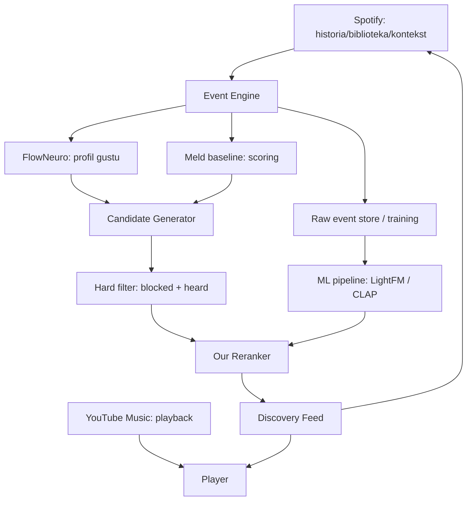

# Architektura

## Warstwy

### Core (Swift package, bez UI)

- `Models` — `Track`, `Artist`, `Album`, `YouTubeMatch`
- `Events` — `PlaybackEvent`, `EventType`, `EventSource`, `EventContext`
- `Profile` — `UserProfile`, `DiscoveryMode`, `SessionContext`
- `Recommendation` — `Candidate`, `Recommendation`, `RankingContext`
- `Engine` — `EventEngine`, `MeldBaseline`, `FlowProfile`, `Reranker`, `DiscoveryEngine`
- `Matching` — `TrackMatcher` (Spotify → YouTube)
- `Providers` — `MusicProvider`, `SpotifyProvider`, `YouTubeMusicProvider`,
  `StreamResolver`, `ProviderRouter`

### iOS (SwiftUI)

- `RootTabView` — Discover / Search / Library / Me + mini-player
- `DiscoverView` — tryby discovery + półki
- `DiscoveryFeedView` — karty ❤️/👎/▶ + „Why this?”
- `PlayerView` — Play here / Open in Spotify
- `MeView` — transparentny profil gustu

### Admin (FastAPI)

Endpointy: ingest zdarzeń, metryki, podgląd pseudonimizowanych zdarzeń, debugger
rekomendacji, wersje modeli, eksperymenty A/B.

### ML (Python)

- normalizacja zdarzeń → macierz interakcji → LightFM → zapis modelu → ewaluacja.

## Ważne założenia

1. **Playback = port/fork Metrolist.** Nie piszemy własnego od zera.
   `YouTubeMusicProvider` i `StreamResolver` to punkty integracji.
2. **Recommender nie wie, skąd pochodzi historia** (Spotify / YT / import).
   Wszystko normalizowane do `PlaybackEvent`.
3. **UI nie zależy od konkretnego modelu** — `DiscoveryEngine` wystawia feed,
   a modele można podmieniać (A/B).
